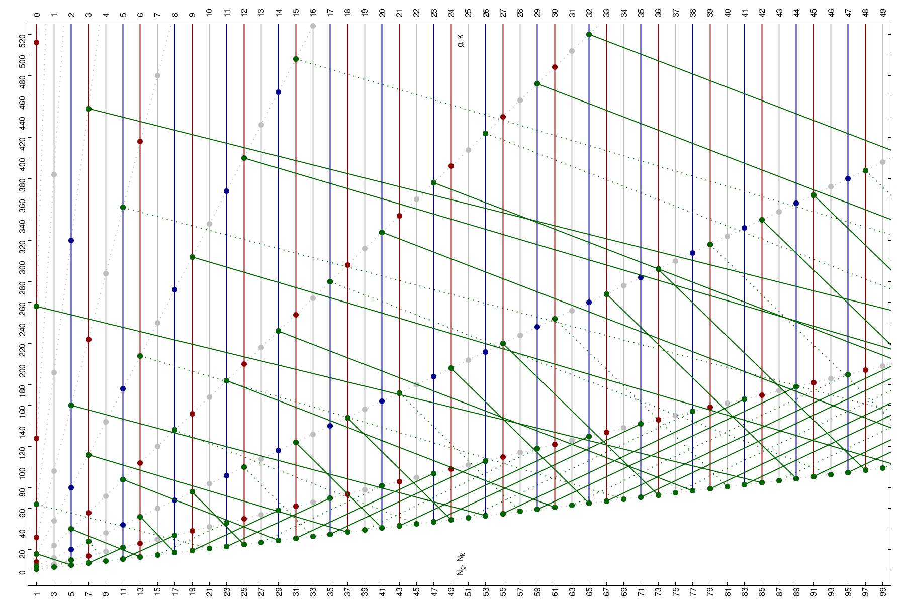
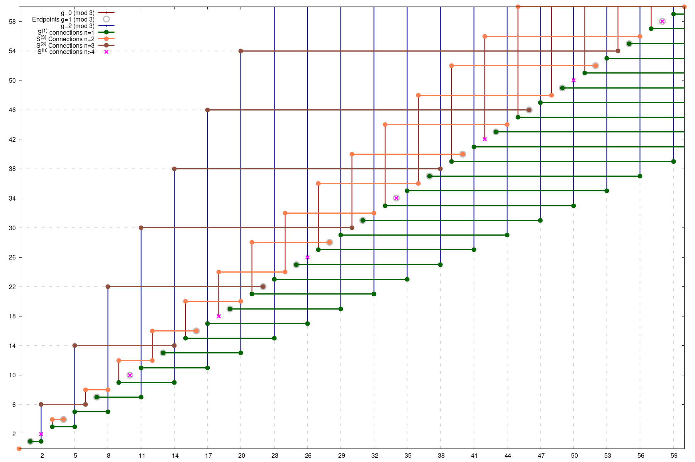

# Collatz tree decomposed
## Dear Visitor!

Many thanks for the feedback, I will work on it as soon as possible!
Actually, I haven't read other articles before because it would have probably demotivated me during the work. It's not the best order to do it, I know..

As this article is not (yet) on arxiv, the link to this repo has been posted in several discussion groups and some people related to this topic were informed.

Feel free to fork this repository and/or create a derived article from it but please give credits :)

If you think it’s worth publishing and you are an endorser, please tell me!

If you found some bug or have suggestions to beautify the images in the pdf, please tell me! Pull requests welcome!

If you have found a way to solve the graph, please DON’T tell me, as I’m probably not able to verify it.

# Abstract
By decomposing the Collatz tree into a two-dimensional odd-even relation we show that it is sufficient to consider odd numbers (or a subset of even numbers) only using graph theory. A simple set of equations is used to build a connection graph which shows that all odd numbers are connected. We show that any valid proof that shows that all odd numbers (or a subset of even numbers) are connected without knowing their exact relation automatically proves the Collatz conjecture. Reasonable solutions solving the graph using graph theory or linear algebra are suggested.

# The Article
[Collatz tree decomposed](collatz_tree_decomposed.pdf)

# Odd-even-odd network by odd numbers N_g=2g+1, N_k=2k+1 and index g,k

# Odd-to-odd network by index g,k

